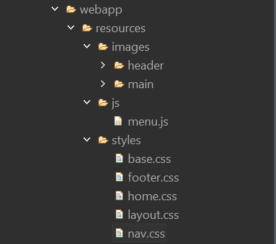

**Índice**

[1. Introducción.]

[2.1 Descripción del error.]

[2.2 Causa técnica:]

[2.3 Solución del error]

[3. Nuevas dependencias en el pom.xml.]

[4. Creación de plantilla para la web.]

[5. Pruebas.]

[5.1 Pruebas funcionales HTTP.]

# 1. Introducción.

En esta versión se solucionó un error de compilación no detectado en la versión anterior y se procedió a dar diseño a una plantilla que servirá como base de todas las vistas de la aplicación. Así mismo se aplicó dicha plantilla a la vista home.

**2. Solución del error de compilación.**

## 2.1 Descripción del error.

Al ejecutar **“mvn clean”** para borrar la carpeta target y así garantizar una compilación limpia con **“maven install”** , se obtenía un error de compilación en la prueba de integración **ControllerHomeIT**.  
El error indicaba que no se podía acceder a la clase **org.hamcrest.Matcher** porque no estaba en el *classpath* de test.

## 2.2 Causa técnica:

En la clase **ControllerHomeIT** se había realizado un **import estático con comodín** (\*) de los métodos de la clase **MockMvcResultMatchers.**

La clase **MockMvcResultMatchers** define varios métodos de prueba cuyos **overloads** utilizan tipos de **Hamcrest** (org.hamcrest.Matcher) en sus firmas.

Aunque en **ControllerHomeIT** **no se usaban directamente** esos **overloads** que dependían de **Hamcrest**, el compilador necesita **cargar la clase completa** para resolver el import con comodín. El problema no se detectó durante la realización de las pruebas de la versión anterior porque en compilaciones incrementales , si la clase ya estaba compilada en target/test-classes, no se vuelve a compilar.

Al hacer ejecutar el comando **“Maven clean”,** se elimina esa carpeta y cuando re recompila el código desde cero, e fuerza a Maven a procesar el import problemático.

## 2.3 Solución del error

La solución fue añadir **Hamcrest** como dependencia en pom.xml.

# 3. Nuevas dependencias en el pom.xml.

| **Nombre**       | **versión** | **tipo**              | **Comentario**                                                                                                                                                 |
|------------------|-------------|-----------------------|----------------------------------------------------------------------------------------------------------------------------------------------------------------|
| Hamcrest (scope) | 2.2         | Implementación (test) | Proporciona *matchers* para escribir aserciones más expresivas en las pruebas unitarias, normalmente usado junto con JUnit (assertThat, containsString, etc.). |

# 4. Creación de plantilla para la web.

Para garantizar la consistencia visual, se definió una **plantilla base** para todas las vistas de la aplicación mediante un **tag file JSP** llamado layout.tag. Esta plantilla **incluye** fragmentos (.jspf) diseñados de forma modular para el **header**, la **barra de navegación** y el **footer**.

Dentro de layout.tag, la etiqueta **\<jsp:doBody/\>** actúa como placeholder: inserta el cuerpo de contenido que cada vista JSP aporta al usar la plantilla. El flujo es: el controlador devuelve un nombre de vista, el ViewResolver lo traduce al JSP correspondiente, y ese JSP utiliza la plantilla con gracias a las etiquetas **\<t:layout\> ... \</t:layout\>;** el contenido situado entre las etiquetas del tag se renderiza en el lugar de **\<jsp:doBody/\>.**

De esta forma, el contenido específico se define únicamente en archivos .jsp, mientras que la estructura común vive en layout.tag y en los fragmentos .jspf. Este enfoque fomenta la **modularización**, la **reutilización** y reduce la duplicación de código, lo cual facilita su mantenimiento.

**4.1 Estilos de las vistas.**

En la plantilla layout.tag se enlazaron varias hojas de estilo CSS responsables del diseño de las vistas.  
Se organizaron las hojas de estilo en distintos niveles para estructurar y mantener el código siguiendo principios de **modularidad**, **reutilización** y **mantenibilidad**.

La organización adoptada es la siguiente:

**Hoja de estilo base**: define variables CSS con valores predeterminados que se aplican de forma global en todas las vistas.

**Hoja de disposición** (*layout*): establece las reglas que afectan a la estructura y posición de los elementos comunes de la aplicación.

**Hoja específica para el Header**: contiene exclusivamente los estilos del encabezado.

**Hoja específica para el Nav**: define los estilos de la barra de navegación.

**Hojas de estilo por página**: por ejemplo, una hoja para los elementos exclusivos de la vista *Home*. De forma análoga, se crearán hojas específicas para los elementos propios de nuevas páginas a medida que se incorporen.

Las vistas están diseñadas para que sean responsivas para que ajusten su valor al tamaño de la ventana. Cuando la pantalla tiene un ancho inferior a 992 píxeles, el menú de opciones se contrae y se engloba en un botón tipo hamburguesa que se despliega al pulsar en el. El comportamiento del botón se controla gracias a un archivo desarrollado en JavaScript llamado menú.js.

# 5. Pruebas.

## 5.1 Pruebas funcionales HTTP.

**Prueba funcional 1:** Acceso a **/** tras limpiar y recompilar el proyecto.

**Acción:** Abrir en el navegador la dirección <http://localhost:8080/PueyoAbogadosApp2/>

**Resultado esperado:** Respuesta HTTP 200 con el HTML de home.jsp y que contenga el nuevo diseño de la web.

**Resultado obtenido:** El esperado.

**Prueba funcional 1:** Acceso a **/** y comprobar la contracción del menú cuando la pantalla disminuye de 992px así como la respuesta a pulsaciones de dicho botón (apertura cierre).

**Acción:** Abrir en el navegador la dirección <http://localhost:8080/PueyoAbogadosApp2/> y disminuir el tamaño de la pantalla por debajo de 992px. Presionar varias veces el botón.

**Resultado esperado:** El menú debe desaparecer y aparecer en su lugar un menú tipo hamburguesa. Tras presionar en este menú debe desplegar las opciones y replegarlas si vuelve a ser pulsado.

**Resultado obtenido:** El esperado.

