**Índice**

[1. Introducción]

[2. clase MyWebAppInitializer:]

[3. Clase AppConfig:]

[4. Clase controller_Home]

[5. Archivo home.jsp.]

[6. Style_home.css]

[7. Explicación del funcionamiento de la aplicación.]

[8. Contenido del contenedor de Servlets de Tomcat (Servlet Context)]

[9. Contenido del contenedor de Spring (Application Context)]

[10. Dependencias incluidas en el archivo pom.xml]

[11. Test.]

[11.1 Pruebas funcionales HTTP.]

[11.2 Pruebas unitarias]

[11.3 Pruebas de integración ligera]

[12. Estructura del proyecto]

# 1. Introducción

En esta primera versión se crea la estructura base del proyecto. Este proyecto será de tipo **Maven** y utilizará el empaquetado tipo **WAR**. Se utilizará la **versión 10.1.28** del servidor externo Tomcat. Tras realizar este commit, la aplicación estará configurada para desplegarse en el servidor y mostrar una página *.jsp* de prueba con un texto.

La configuración del **descriptor de despliegue** se realiza en una clase llamada **MyWebAppInitializer** la cual implementa la interfaz **WebApplicationInitializer** (Así se evita también la configuración en el antiguo archivo *web.xml*). Esta clase irá dentro de un paquete llamado **com.jpueyodev.**

**Descriptor de despliegue**: Es un conjunto de instrucciones para el servidor que configuran lo siguiente: Qué servlets debe cargar Qué rutas atenderá cada servlet Qué filtros o listeners deben ejecutarse Otros ajustes (errores, seguridad etc) 

# 2. clase MyWebAppInitializer:

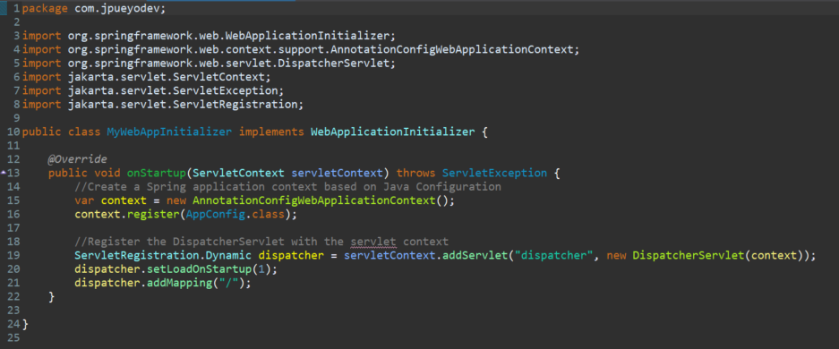

El método **onStartup(),** implementado de la interfaz, configura la aplicación dentro del servidor **Tomcat** en el momento de su arranque.

En primer lugar, se crea el **contenedor de Spring** que cargará la configuración desde una clase java etiquetada con anotaciones llamada **AppConfig**, la cual se encuentra en el mismo paquete. En el **contenedor de Spring** se guardarán los beans, controladores y otras configuraciones.

Por otro lado, se registra el **DispatcherServlet** que será el “puente” entre las peticiones web y la aplicación, buscando el controlador adecuado para cada petición. Cuando el controlador devuelva la respuesta, el **DispatcherServlet** será el encargado de devolverla como HTML renderizado por JSP.

A este servlet se le añaden dos propiedades; la **prioridad de carga**, en este caso 1, lo cual indica que incluso antes de recibir la primera petición, se cargue este servlet (por si hay algún problema de configuración, que se detecte al inicio). Por otro lado, se le indica **las rutas a las que debe responder** este servlet. Estableciendo la ruta “/” se le indica que atienda a TODAS las peticiones que lleguen a esta aplicación.

Por otro lado, tenemos la clase **AppConfig** la cual, por ahora, cumple tres funciones:

1.  Configurar el contenedor de Spring.
2.  Registrar Beans.
3.  Configurar aspectos del MVC.

# 3. Clase AppConfig:

**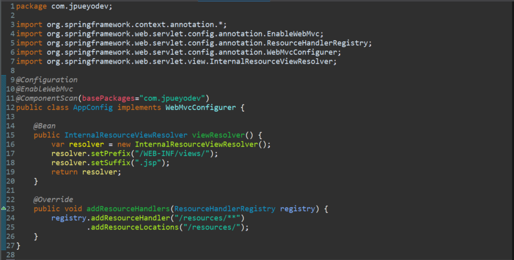**

Gracias a la etiqueta **@Configuration**, la clase se configura como fuente de beans. Todos los métodos marcados con la etiqueta **@Bean** se registrarán en el contenedor de Spring (**WebApplicationContext**).

La etiqueta **@ComponentScan(basePackages=”com.jpueyodev”)** indica a esta clase que escanee el paquete y subpaquetes incluidos en **com.jpueyodev** en busca de clases anotadas con anotaciones como **@Controller**, **@Component**, etc.

Por último, la etiqueta **@EnableWebMvc** activa la configuración básica de **Spring MVC** para que el **DispatcherServlet** (registrado en la clase **MyWebAppInitializer**) sepa manejar las peticiones, encontrar los controladores, validar los datos y resolver las vistas.

En esta clase solo tenemos un bean por ahora. Se trata de un método llamado **viewResolver()**, que devuelve un objeto de la clase **InternalResourceViewResolver**. Este método está anotado con la clase **@Bean**.

Este bean traduce el nombre lógico devuelto por un controlador a una ruta física **jsp**. Como se verá a continuación, tenemos un controlador que ante la petición get (“/”) devolverá un nombre lógico **“home”**. Este método le añadirá un prefijo y un sufijo armando la ruta **“/WEB-INF/views/home.jsp**. Para que todo funcione, se tendrá que haber creado un archivo llamado **home.jsp** en la carpeta **views** contenida a su vez en la carpeta **WEB-INF.**

Si todo está correcto, el **DispatcherServlet**, delegará en el **InternalResourceViewResolver**, que resolverá y renderizará la vista JSP

Por último, cabe comentar que en esta clase se ha implementado la interfaz **WebMvcConfigurer**. Esta interfaz permite sobrescribir métodos de Spring MVC que vienen configurados por defecto cuando se agrega la etiqueta **@EnableWebMvc** y que de otra forma no sería posible sobrescribir.

Concretamente se ha sobrescrito el método **addResourceHandlers()** para que cuando llegue una petición a /resources/\*\* no sea procesado mediante un controlador, sino que la devuelva como un archivo estático desde dicha carpeta. Sirve básicamente para decirle al sistema donde están los recursos personalizados como hojas de estilo css o scripts.

# 4. Clase controller_Home

**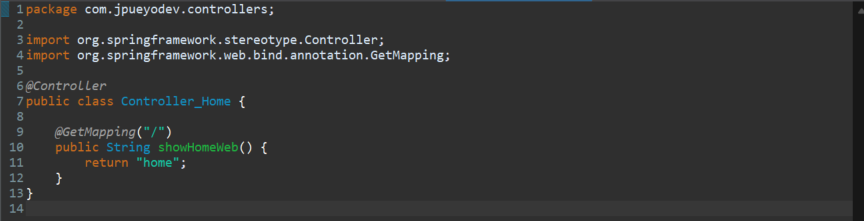**

Esta clase está ubicada en el subpaquete **com.jpueyodev.controllers.**

Está anotada con **@Controller**, lo que permite que el mecanismo de *component scanning* activado por **@ComponentScan** en **AppConfig** detecte esta clase y la registre como un bean en el contenedor de Spring.

Por ahora contiene un único método, **showHomeWeb(),** que atiende peticiones HTTP **GET** en la ruta raíz /, gracias a la anotación **@GetMapping("/").** Este método devuelve el nombre lógico de la vista **"home"**, que corresponde a un archivo JSP ubicado en **/WEB-INF/views/home.jsp** (esta carpeta está protegida para que los JSP no se accedan directamente por URL).

Cuando un cliente realiza una petición GET en la ruta raíz, el **DispatcherServlet** localiza este controlador y ejecuta **showHomeWeb().** El nombre lógico de vista devuelto ("home") se pasa al **InternalResourceViewResolver**, que aplica el prefijo y sufijo configurados (/WEB-INF/views/ y .jsp respectivamente) para obtener la ruta completa del JSP. Finalmente, el **DispatcherServlet** renderiza el JSP y envía el HTML resultante como respuesta al cliente.

# 5. Archivo home.jsp.

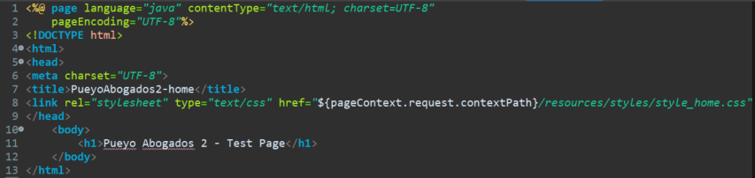

Este archivo corresponde a una **vista JSP** básica utilizada en la aplicación en su estado inicial.

Como se ha indicado anteriormente, se renderiza cuando el usuario accede a la ruta raíz /.

Contiene código **HTML estático**, aunque podría incluir código Java embebido gracias a la directiva \<%@ page language="java" contentType="text/html; charset=UTF-8" pageEncoding="UTF-8"%\>.

En este caso, el JSP simplemente muestra un encabezado (\<h1\>) como página de prueba, pero al estar ubicado en **/WEB-INF/views/** no es accesible directamente por URL, sino a través del flujo Spring MVC mediante el **DispatcherServlet** y el **ViewResolver**.

Tiene enlazado un fichero .css llamado **style_home.css** el cual colorea de rojo el valor incluido en etiquetas h1.

# 6. Style_home.css

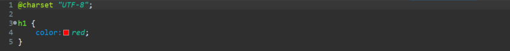

# 7. Explicación del funcionamiento de la aplicación.

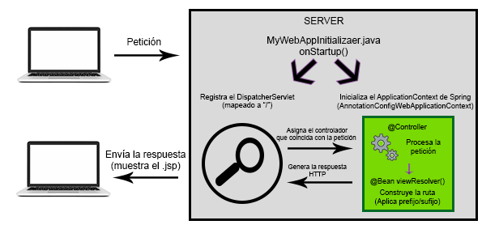

Al desplegar la aplicación, el contenedor descubre **MyWebAppInitializer**, crea el **ApplicationContext** y registra el **DispatcherServlet**. A partir de ahí, cada petición pasa por el **DispatcherServlet**.

El **DispatcherServlet** actúa como front controller: analiza la URL solicitada y asigna la petición al controlador (**@Controller**) que mejor coincide con la ruta.

El método del controlador procesa la lógica necesaria y devuelve un nombre lógico de vista, que es resuelto por el **InternalResourceViewResolver**. Este componente construye la ruta física al archivo JSP aplicando el prefijo y sufijo configurados (por ejemplo, "home" → /WEB-INF/views/home.jsp).

Finalmente, el JSP se procesa en el servidor y el resultado HTML se envía como respuesta HTTP al cliente.

# 8. Contenido del contenedor de Servlets de Tomcat (Servlet Context)

Tomcat crea su contenedor de Servlets antes que Spring y en el se registran los servlets y filtros que atenderán las peticiones HTTP.

| **Nombre**     | **Clase**                                                                         | **Función**                                                                                                                                                                                                                       |
|----------------|-----------------------------------------------------------------------------------|-----------------------------------------------------------------------------------------------------------------------------------------------------------------------------------------------------------------------------------|
| dispatcher     | Registrado en MyWebAppInitializer.onStartup() como instancia de DispatcherServlet | Atiende todas las peticiones dirigidas a la raíz /, excepto aquellas gestionadas por otros servlets como el DefaultServlet. Encaminan las peticiones a Spring MVC.                                                                |
| DefaultServlet | Incluido por defecto en Tomcat                                                    | Sirve recursos estáticos cuando no los gestiona otro servlet. En esta aplicación, su papel es mínimo porque el DispatcherServlet está mapeado a / y Spring atiende también los recursos estáticos mediante addResourceHandlers(). |

# 9. Contenido del contenedor de Spring (Application Context)

| **Bean**                     | **Clase en la que está incluida**                      | **Función**                                                                                                                       |
|------------------------------|--------------------------------------------------------|-----------------------------------------------------------------------------------------------------------------------------------|
| InternalResourceViewResolver | Definido en AppConfig (@Configuration)                 | Traduce el nombre lógico de vista devuelto por un controlador a la ruta física del JSP (añadiendo prefijo y sufijo configurados). |
| Controller_Home              | @Controller, detectado por @ComponentScan en AppConfig | Atiende peticiones GET en / y devuelve el nombre lógico "home".                                                                   |
| Componentes MVC              | Registrados automáticamente por @EnableWebMvc          | Incluyen HandlerMapping, HandlerAdapter, convertidores de mensajes, y otros elementos de la infraestructura Spring MVC.           |

# 10. Dependencias incluidas en el archivo pom.xml

| **Dependencia**                      | **Versión** | **Tipo**              | **Función**                                                                                                      |
|--------------------------------------|-------------|-----------------------|------------------------------------------------------------------------------------------------------------------|
| jakarta.servlet-api                  | 6.0.0       | API                   | Define las clases de servlets y peticiones HTTP                                                                  |
| jakarta.servlet.jsp-api (scope)      | 3.1.1       | API                   | Define cómo funcionan las páginas JSP.                                                                           |
| jakarta.servlet.jsp.jstl-api (scope) | 3.0.2       | API                   | Define las etiquetas estándar JSTL                                                                               |
| jakarta.servlet.jsp.jstl (GlassFish  | 3.0.1       | Implementación        | Ejecuta el código de las etiquetas JSTL.                                                                         |
| spring-webmvc                        | 6.2.9       | Implementación        | Infraestructura Spring MVC (controladores, DispatcherServlet, vistas)                                            |
| spring-test (scope)                  | 6.2.9       | Implementación (test) | Proporciona utilidades para pruebas unitarias e integración en aplicaciones Spring (MockMvc, TestContext, etc.). |
| junit-jupiter (scope)                | 5.13.3      | Implementación (test) | API y motor de ejecución para escribir y ejecutar pruebas con JUnit 5.                                           |
| junit-jupiter-engine (scope)         | 5.13.3      | Implementación (test) | Motor de ejecución de JUnit 5 que permite que las pruebas escritas con la API se ejecuten realmente.             |

| **Plugin**       | **Versión** | **Función**                                                                                                                                                                                                                                                                                                                        |
|------------------|-------------|------------------------------------------------------------------------------------------------------------------------------------------------------------------------------------------------------------------------------------------------------------------------------------------------------------------------------------|
| maven-war-plugin | 3.4.0       | Empaqueta la aplicación como un archivo WAR listo para desplegar en Tomcat. Aunque este plugin viene por defecto en Maven/IDE, fijar su versión en el pom.xml garantiza que todos los entornos usen la misma, evitando fallos por diferencias de configuración y asegurando compatibilidad con Jakarta EE y proyectos sin web.xml. |

# 11. Test.

# 11.1 Pruebas funcionales HTTP.

Las pruebas funcionales son aquellas que verifican que la aplicación cumple su función de negocio de principio a fin, simulando el uso real que haría un usuario.

No se centran en probar métodos aislados (como se haría en una prueba unitaria), sino en comprobar que todo el flujo completo —desde que entra la petición HTTP hasta que se devuelve la respuesta— funciona como debe.

**Prueba funcional 1:** Acceso a **/.**

**Acción:** Abrir en el navegador la dirección <http://localhost:8080/PueyoAbogadosApp2/>

**Resultado esperado:** Respuesta HTTP 200 con el HTML de home.jsp y que contenga \<h1\>Pueyo Abogados 2 – Test Page\</h1\> en color rojo.

**Resultado obtenido:** El esperado.

| 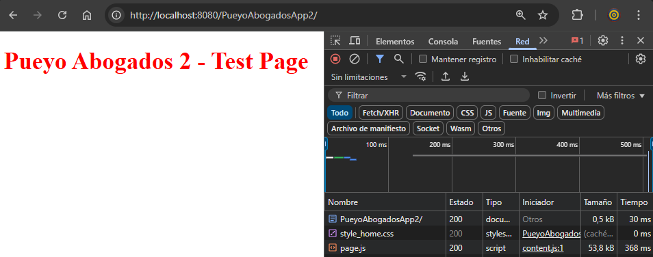 |
|-------------------------------------------------|

**Prueba funcional 2:** Acceso al recurso estático **style_home.css.**

**Acción:** Abrir en el navegador la dirección <http://localhost:8080/PueyoAbogadosApp2/resources/styles/style_home.css>

**Resultado esperado:** Respuesta HTTP200 con el contenido del CSS.

**Resultado obtenido:** El esperado.

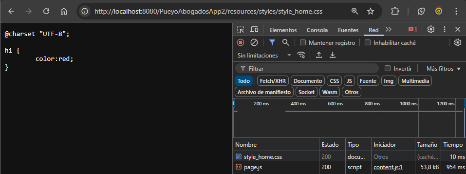

**Prueba funcional 3**: Acceso a una ruta inexistente.

**Acción:** Abrir en el navegador la dirección <http://localhost:8080/PueyoAbogadosApp2/xxx>

**Resultado esperado:** Error HTTP 404 – No Encontrado

**Resultado obtenido:** El esperado.

| 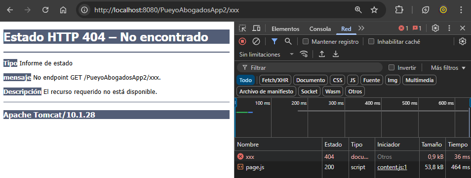 |
|-------------------------------------------------|

# 11.2 Pruebas unitarias

Las pruebas unitarias son pruebas que se centran en verificar el comportamiento de una parte aislada de código (normalmente un método o clase) sin depender del resto de la aplicación.

**Prueba unitaria 1**: Verificar que el método **showHomeWeb()** del controlador **Controller_Home** devuelve el nombre de vista "home".

**Acción:** Crear una instancia del controlador **Controller_Home**, invocar el método showHomeWeb() y comprobar con un assert que el valor devuelto es "home".

**Ubicación/nombre de la prueba:** /src/test/java/com/jpueyodev/unittest/ControllerHomeTest.java

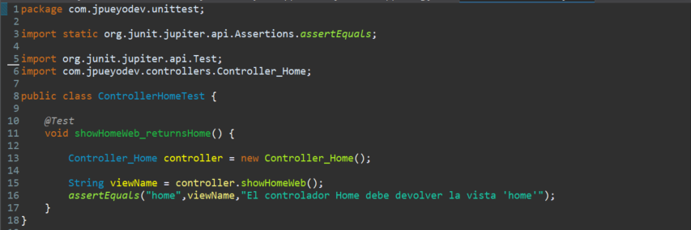

**Desarrollo de la prueba unitaria**

El método que realiza la prueba unitaria se llama **showHomeWeb_returnsHome()** y está anotado con **@Test.** Dentro de este método, se instancia manualmente un objeto de la clase **Controller_Home**, que por ahora es el único controlador existente en la aplicación.

A continuación, se invoca el método **showHomeWeb()** de dicha instancia y el valor que devuelve se almacena en una variable de tipo String.

Por último, se verifica mediante una aserción **(assertEquals)** que la cadena devuelta por el método coincide exactamente con "home". Si no existe coincidencia, la prueba fallará y se mostrará el mensaje definido en la aserción.

**Resultado esperado:** El método showHomeWeb() debe devolver exactamente la cadena "home". La prueba pasará si el valor devuelto coincide con este texto y fallará en caso contrario, mostrando el mensaje: *"El controlador Home debe devolver la vista 'home'"*.

**Resultado obtenido**: El esperado.

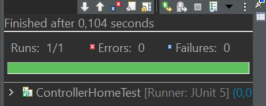

# 11.3 Pruebas de integración ligera

**Las pruebas de integración** son aquellas que **verifican que varias partes de la aplicación funcionan correctamente juntas**, incluyendo dependencias reales o simuladas que en una prueba unitaria se usarían.

**Prueba de integración 1**: Verificar que el contexto de la aplicación Spring MVC se carga correctamente en un entorno de prueba.

**Acción:** Ejecutar un test unitario con **JUnit 5** y **Spring Test** que inicializa el **WebApplicationContext** usando la configuración Java (**AppConfig.class**).

**Ubicación/nombre de la prueba:** src/test/java/com/jpueyodev/integrationtest/ContextLoadIT.java

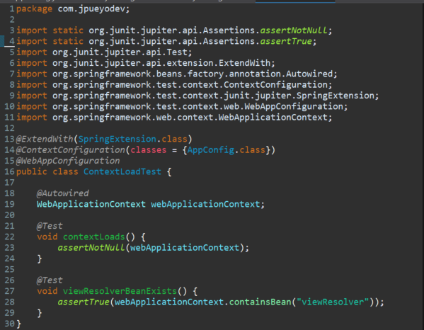

**Desarrollo de la prueba de integración:**

Esta prueba tiene la misión de asegurar que la configuración de Spring del proyecto funciona y que el contenedor de Spring puede arrancar sin errores y con la configuración deseada, es decir, que no sea null y que las dependencias se inicialicen sin lanzar excepciones.

La clase de test **ContextLoadIT** se anota de la siguiente manera:

**@ExtendWith(SpringExtension.class)** → Esta anotación “conecta” **JUnit 5** con **Spring Test Framework**. La dependencia spring-test proporciona la clase SpringExtension y la dependencia junit-jupiter-api es la que permite interpretar la anotación. Sin esta conexión, JUnit no sabría cómo iniciar un contexto de Spring.

**@ContextConfiguration(classes = {AppConfig.class})** → Esta anotación, proporcionada por la dependencia spring-test, indica qué configuración se debe usar para crear el contexto de Spring. En este caso, se especifica la clase que contiene la configuración (**AppConfig**).

**@WebAppConfiguration** → Esta anotación, también proporcionada por la dependencia spring-test, se utiliza para indicar que el test es para una aplicación web, por lo que el ApplicationContext debe ser de tipo WebApplicationContext. Es necesaria para probar componentes que dependen de un contexto web y simula un entorno web dentro del contexto de Spring.

Tras anotar la clase, se crea un atributo de tipo **WebApplicationContext**, que se anota con **@Autowired** para inyectar el contexto de Spring usado en la aplicación, pero esta vez, en un entorno de pruebas.

A continuación, se define el método **contextLoads()**, anotado con **@Test** (proporcionada por junit-jupiter). Este método verifica que, tras cargar el contexto de Spring, este no es null y no se han lanzado excepciones.

Por último, se crea otro método anotado con **@Test** llamado **viewResolverBeanExists()** para comprobar que, después de cargar el contenedor de Spring con la configuración definida en AppConfig, existe el bean **"viewResolver"**. Si este test pasa, podemos asegurar que el bean se ha cargado correctamente.

Si las aserciones establecidas en los métodos anotados con **@Test** no se cumplen, los test fallarán.

**Resultado esperado:** El **webApplicationContext** debe inyectarse correctamente (no ser null y sin lanzar excepciones durante la inicialización) y el bean **"viewResolver"** debe existir en el contexto, habiendo sido registrado correctamente por la configuración de Spring (AppConfig).

**Resultado obtenido:** El esperado.

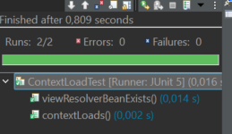

**Prueba de integración 2**: Verificar que el **InternalResourceViewResolver** configurado en **AppConfig** traduce correctamente un nombre lógico de vista ("home") a la ruta física del JSP (/WEB-INF/views/home.jsp) y que la vista resultante es del tipo **InternalResourceView**.

**Acción:** Cargar el contexto de Spring definido en **AppConfig** y utilizar el bean **InternalResourceViewResolver** para resolver el nombre de vista "home", comprobando que devuelve una instancia de **InternalResourceView** y que su ruta corresponde a /WEB-INF/views/home.jsp.

**Ubicación/nombre de la prueba:** src/test/java/com/jpueyodev/integrationtest/ViewResolverIT.java

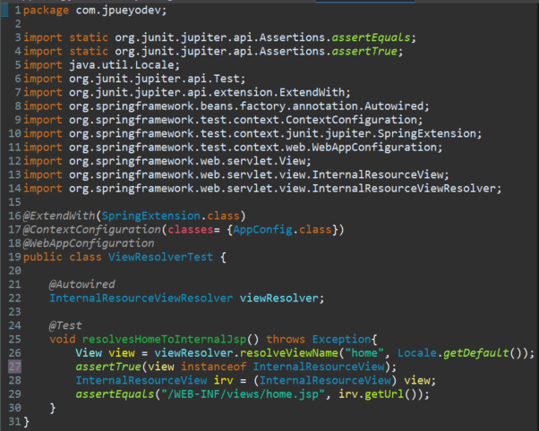

**Desarrollo de la prueba de integración:**

Para realizar esta prueba se crea la clase **ViewResolverIT**, que se anota de forma similar a la clase de la prueba anterior.

Por un lado, se conecta **JUnit 5** con **Spring Test Framework** mediante la anotación **@ExtendWith**, lo que permite que **JUnit** inicialice el contenedor de Spring en un entorno de prueba.

También se usa la anotación **@ContextConfiguration** para indicar que la configuración del contexto de Spring debe cargarse a partir de la clase **AppConfig** definida en el proyecto.

Por último, se usa la anotación **@WebAppConfiguration** para indicar que el contexto de pruebas debe ser del tipo **WebApplicationContext**, lo que habilita un entorno web simulado.

A continuación, se declara un campo de tipo **InternalResourceViewResolver** y se marca con **@Autowired** para que Spring inyecte automáticamente el bean configurado en **AppConfig**.

El método que realizará la prueba se llama **resolvesHomeToInternalJsp()** y está anotado con **@Test**. Este método declara **throws Exception** porque se llama a APIs que pueden lanzar excepciones, y así evitamos capturarlas dentro del propio test.

En el interior, se llama al método **resolveViewName()** del **InternalResourceViewResolver** (inyectado por Spring) para resolver el nombre lógico "home". Esto devuelve un objeto de tipo **View**, que **representa la vista que renderizará la respuesta HTTP**, pero que aún no es el HTML ni el JSP procesado. Es decir, encapsula la información necesaria para mostrar la respuesta, pero sin generarla todavía.

Después, se comprueba si ese objeto **View** es de tipo **InternalResourceView**.

Luego, se hace un *casting* a InternalResourceView al objeto **View** para poder acceder a métodos que no existen en la interfaz **View**. Entre ellos está **getUrl(),** que devuelve la ruta real del JSP dentro de la aplicación, generada por el **ViewResolver** aplicando su prefijo y sufijo configurados.

Finalmente, se comprueba que la URL generada coincide exactamente con la ubicación esperada del JSP: /WEB-INF/views/home.jsp.

**Resultado esperado:** El InternalResourceViewResolver debe resolver el nombre lógico "home" a una vista de tipo InternalResourceView cuya URL interna sea exactamente /WEB-INF/views/home.jsp, confirmando que la configuración de prefijo y sufijo en AppConfig funciona correctamente y que el sistema localizaría el JSP correcto en tiempo de ejecución.

**Resultado obtenido**: El esperado.

**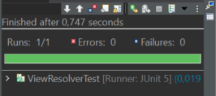**

**Prueba de integración 3**: Verificar que la ruta raíz / es procesada correctamente por el controlador y que el sistema devuelve la vista lógica "home" con un *forward* interno al JSP /WEB-INF/views/home.jsp.

**Acción:** Se realiza una petición HTTP simulada GET "/" usando **MockMvc**, y se comprueba que el código de estado HTTP sea **200 (OK)**, el nombre lógico de la vista devuelto por el controlador sea **"home"** ,que el *ViewResolver* genere correctamente la URL interna /WEB-INF/views/home.jsp y el DispatcherServlet realice un *forward* interno a esa ruta.

**Ubicación/nombre de la prueba:** src/test/java/com.jpueyodev/integrationtest/Controller_HomeIT.java

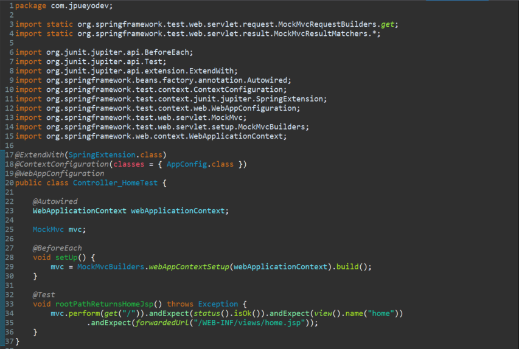

**Desarrollo de la prueba de integración:**

Para realizar esta prueba se crea la clase **Controller_HomeTest**, que se anota de forma similar a las clases de pruebas anteriores (**@ExtendWith**, **@ContextConfiguration**, **@WebAppConfiguration**).

Se declara un **WebApplicationContext** y se le inyecta el contexto real de la aplicación gracias a la anotación **@Autowired**. Este contexto incluirá en controlador Home y la configuración establecida en la clase **AppConfig**.

Por otro lado, se declara un objeto de tipo **MockMvc**, que sirve para simular un cliente HTTP y enviar peticiones al DispatcherServlet **sin necesidad de arrancar el servidor Tomcat**.

En el método **setUp()**, anotado con **@BeforeEach**, se conecta **MockMvc** al **WebApplicationContext**. Esto significa que cuando se ejecute la prueba y se simule una petición a la raíz /, Spring la procesará igual que en la aplicación real:

DispatcherServlet → busca un @Controller que coincida → ejecuta el método → obtiene el nombre de la vista → el viewResolver construye la ruta final → JSP.

Por último, el método **rootPathReturnsHomeJsp(),** anotado con @Test, simula una petición GET a / y comprueba tres cosas:

1.  Que la respuesta tenga código de estado **200 OK**.
2.  Que el controlador devuelva el nombre lógico de vista "home".
3.  Que el **InternalResourceViewResolver** traduzca ese nombre a la ruta real /WEB-INF/views/home.jsp mediante un forward interno.

**Resultado esperado:** El test debe pasar confirmando que el mapeo de la ruta, el retorno del nombre lógico de la vista y la resolución de la URL física del JSP funcionan correctamente en la configuración actual de Spring MVC.

**Resultado obtenido:** El esperado.

**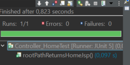**

# 

# 12. Estructura del proyecto

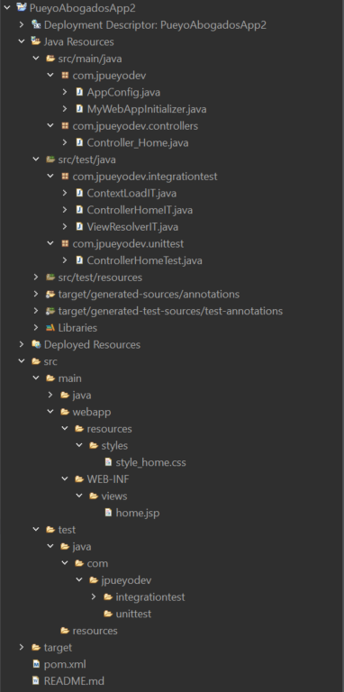
